## ✈️ TourTalk

#### 👨‍💻 SSAFY 13기 1학기 광주 4반 TourTalk (25.04.28 ~ 25.05.28)

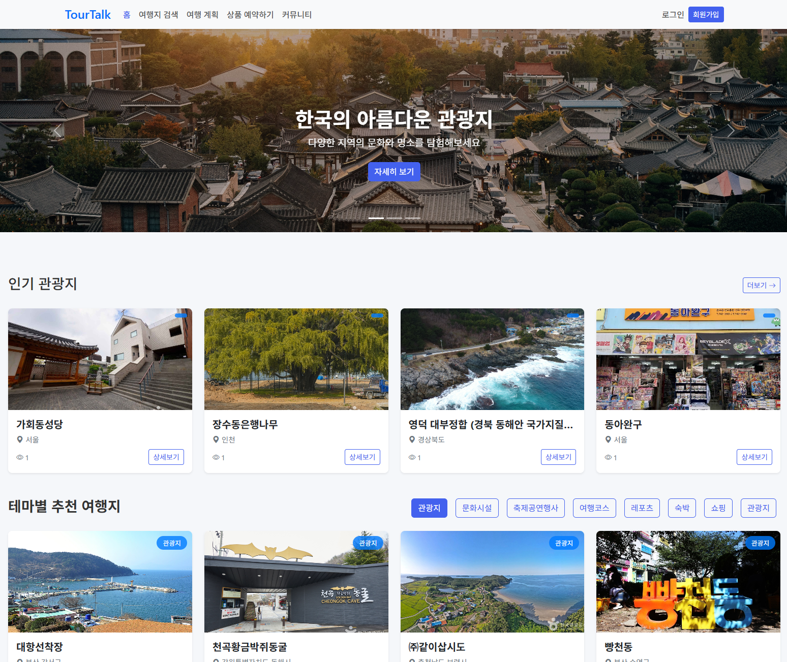

---

## 📑 목차

* [프로젝트 개요](#-프로젝트-개요)
  * [팀원 소개](#1️⃣-팀원-소개)
  * [기획 배경](#2️⃣-기획-배경)
* [서비스 소개](#-서비스-소개)
  * [시연 영상](#1️⃣-시연-영상)
  * [서비스 화면 및 기능](#2️⃣-서비스-화면-및-기능)
* [개발 환경](#-개발-환경)
* [프로젝트 산출물](#-프로젝트-산출물)
  * [요구사항 명세서](#1️⃣-요구사항-명세서)
  * [ERD](#2️⃣-erd)
    
---
## 🏠 프로젝트 개요

### 1️⃣ 팀원 소개

| 정수형 | 전준영 |
|:-:|:-:|
| FrontEnd, BackEnd, Security | FrontEnd, BackEnd, AI |

### 2️⃣ 기획 배경

| 주제 | 지역 기반의 통합 여행 정보 제공 및 큐레이터 해설 연계 플랫폼 |
|:--|:--|
| 배경 | - 현대의 여행은 단순한 이동과 관광을 넘어, 정보 기반의 체계적인 준비와 깊이 있는 경험을 중시하는 방향으로 변화 - 그러나 현재의 여행 플랫폼은 예약, 정보, 후기, 해설 등이 분산되어 있어 사용자 입장에서는 통합적이고 신뢰할 수 있는 플랫폼이 부족한 실정 - 또한 매년 증가하는 학예사(큐레이터) 자격 취득자들은 박물관·미술관 등 일부 기관을 제외하면 실무 활동 기회가 매우 제한적 |

---

## 🗺️ 서비스 소개

### 1️⃣ 시연 영상

[🔗 시연 영상 바로가기](https://youtu.be/5zMbnIc4wWc)

### 2️⃣ 서비스 화면 및 기능

#### 1) 사이트 소개

| 메인 페이지 |
|:-:|
|  |

저희는 사용자에게 인기가 높은 관광지, 테마별, 지역별 관광지를 한눈에 제공하고 있습니다.  
그 중 원하는 테마를 클릭하면 해당 테마에 맞는 관광지 정보를 제공합니다.
 

| 여행지 검색 | 여행지 상세 정보 |
|:-:|:-:|
| 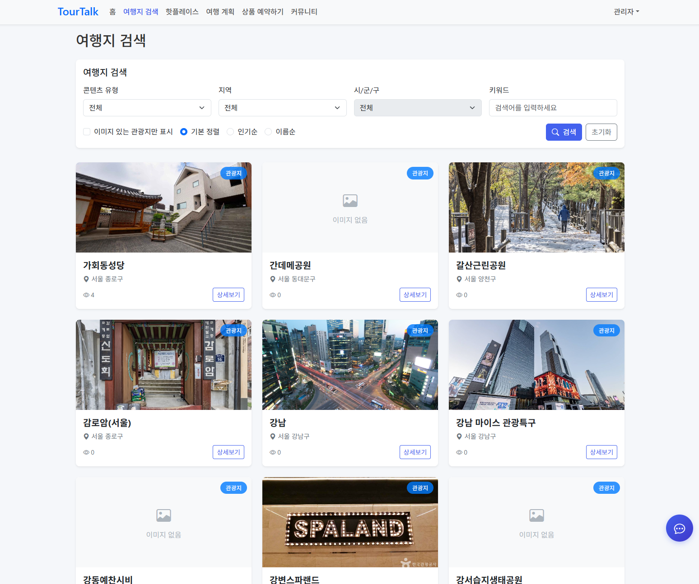 | 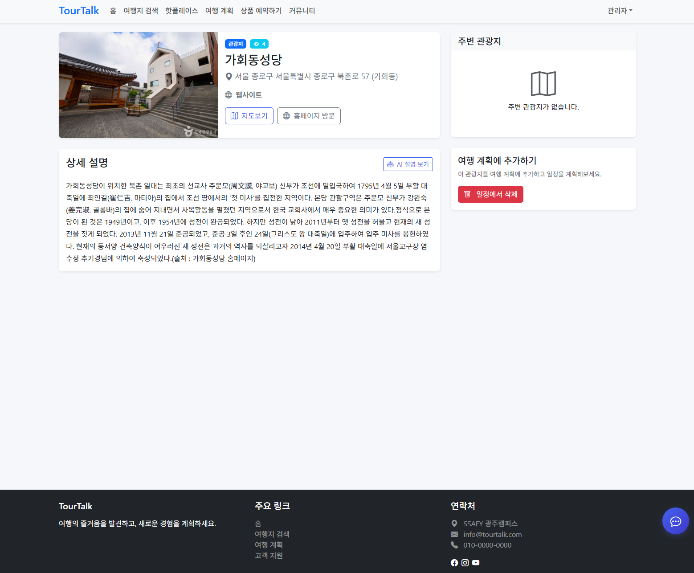 |

여행지 검색을 통해 테마나 지역에 맞는 여행지를 검색하고 상세 정보를 확인할 수 있습니다.
 

| 여행 계획 |
|:-:|
| 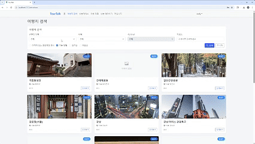 |

본인이 원하는 여행지를 계획에 추가하여 여행 계획을 저장하거나 불러올 수 있습니다.
 

| 핫플레이스 등록 및 관리|
|:-:|
| 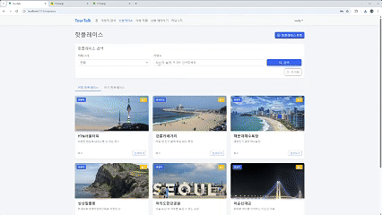 |

본인이 소개해주고 싶은 관광지를 핫플레이스로 등록할 수 있습니다.
 

| 커뮤니티 |
|:-:|
| 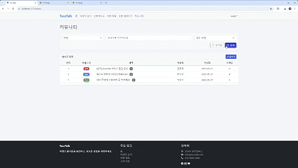 |

커뮤니티 페이지를 통해 사용자는 게시글과 댓글을 작성하여 소통할 수 있습니다.

***

#### 2) 해설 상품

| 상품 예약 |
|:-:|
| 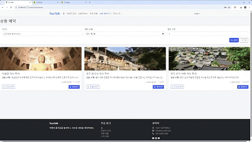 |

일반회원은 학예사 회원이 올린 해설 상품을 예약하고 결제를 해서 예약 확정하거나 취소할 수 있습니다.
 

| 상품 등록 | 상품 관리 |
|:-:|:-:|
| 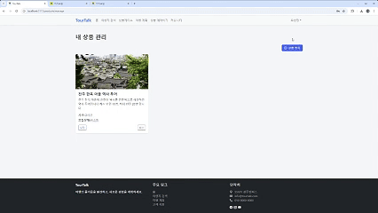 | 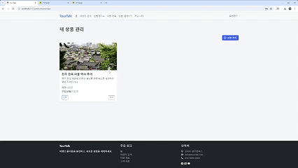 |

학예사 회원은 본인의 해설 상품을 등록하거나 수정 및 삭제를 할 수 있습니다.
 

***

#### 3) AI

저희 사이트에서는 AI를 이용한 관광지 정보 요약, 챗봇 기능을 제공하고 있습니다.

| 관광지 정보 요약 |
|:-:|
| 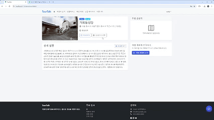 |

선택한 관광지 정보에 대한 AI 요약 정보를 제공합니다.
 

| 챗봇 |
|:-:|
| 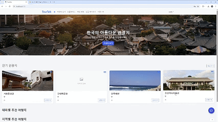 |

챗봇을 사용하여 여행지 추천 및 계획에 대한 조언을 구할 수 있습니다.
 

***

#### 4) 회원가입, 로그인

| 일반 회원 | 학예사 회원 |
|:-:|:-:|
|  | 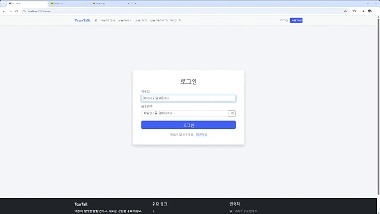 |

사이트를 이용할 일반 회원과 본인의 해설 상품을 등록할 수 있는 학예사 회원이 별도의 회원가입을 통해 사용할 수 있습니다.
 
 

로그인 요청 시 JWT를 이용하여 Access 토큰을 발급합니다.
또한, 로그인 시 사용자의 정보는 pinia로 저장하여 클라이언트 상태로 관리합니다.
 

***

#### 5) 관리자 페이지
| 회원 관리 | 게시글 관리 |
|:-:|:-:|
| 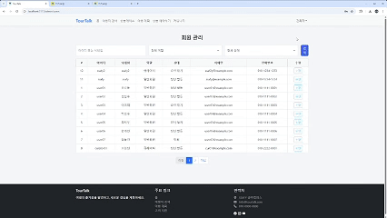 | 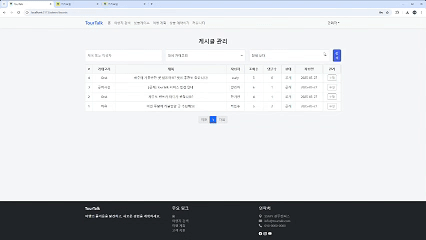 |

관리자는 사이트를 이용하는 회원들을 관리할 수 있습니다.  
또한, 커뮤니티에 작성된 게시글을 관리할 수 있습니다.
 

---

## 🛠️ 개발 환경

| **BackEnd** |         |
|:-|:-|
| **FrontEnd** |   |
| **API** |    |

---

## 📝 프로젝트 산출물

### 1️⃣ 요구사항 명세서
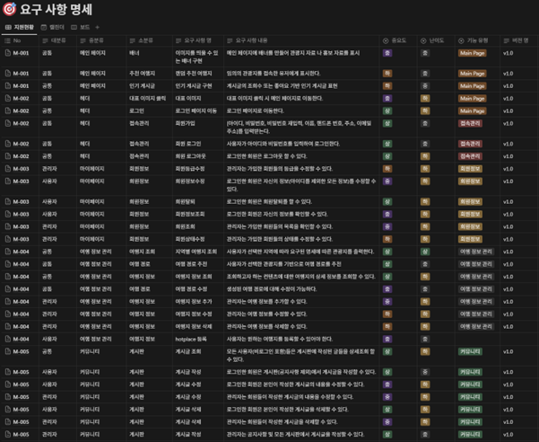

Notion을 이용해 요구사항을 한눈에 확인할 수 있게 요구사항 명세서를 작성하였습니다.
 

***

### 2️⃣ ERD
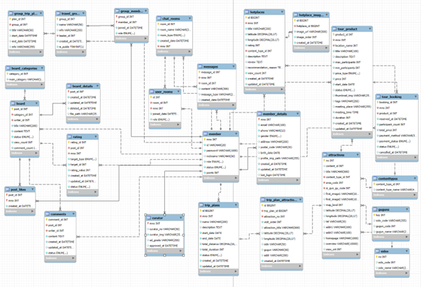
